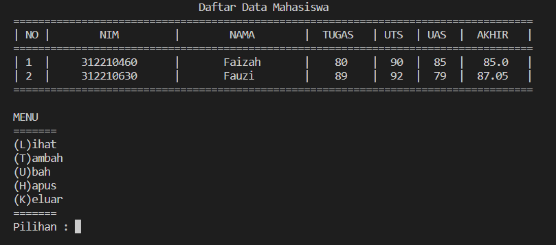

# Praktikum8
# Object-Oriented Programming (OOP)
 
Program Class Data_Mahasiswa

# DIAGRAM CLASS

# FLOWCHART

# Programnya

# PENJELASAN PROGRAM

Object-Oriented Programming(OOP) adalah sebuah cara  untuk membangun sebuah aplikasi dengan memandang sebagai presentasi objek-objek yang saling mendukung serta berinteraksi dari satu objek ke objek yang lainnya dan dapat dikatakan code program akan terbentuk berkelompok berdasarkan objek. 

1. Kita deklarasikan atau menginputkan terlebih dahulu sebuah variabel bertipe data dictionary kosong data={} yang nantinya akan kita inputkan sebuah data yang terdiri dari: nama, nim, nilai_tugas, nilai_uts, nilai_uas dan nilai_akhir.
2. Selanjutnya kita membuat class data_mahasiswa()
3. Setelah kita membuat class kita lanjutkan dengan membuat fungsi. fungsi yang akan kita gunakan yaitu:
- Fungsi Tampilkan(), untuk menampilkan data yang sudah kita input
- Fungsi Tambah(), untuk menambah sebuah data yang ingin kita input
- Fungsi Hapus(nama), untuk menghapus nama pada data 
- Fungsi Ubah(nama), untuk mengubah nama pada data
- Fungsi Salah(), untuk inputan yang tidak sesuai perintah 
4. Dan kita akan menggunakan Perulangan while (while loop), sehingga dapat diartikan perulangan akan terus mengulang jika inputan benar dan masuk kedalam proses jika tidak, maka perulangan berhenti atau lanjut ke proses selanjutnya. variabel lanjut kita gunakan untuk menginput perintah yang akan kita proses, disini kita menggunakan statement if untuk memproses perintah yang di inginkan sesuai inputan pada variabel lanjut:

# HASIL PROGRAMNYA

- Tambah

- Lihat

- Ubah

- Hapus

- Keluar
